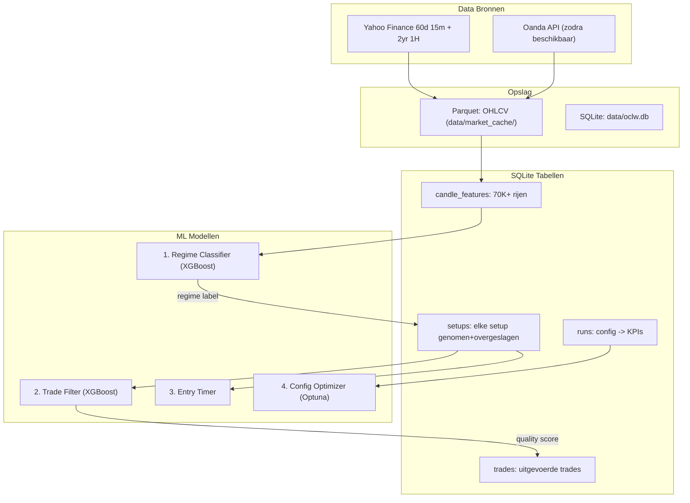

# ML Data Infrastructure + 4 Modellen voor XAUUSD

> Status: Plan fase | Datum: 2026-02-14

## Architectuuroverzicht

---

## Todos

- [ ] Fase 1A: SQLite database module (`src/trader/data/database.py`) met schema voor candle_features, setups, trades, runs
- [ ] Fase 1B: `sqe_xauusd.py` aanpassen - `return_details` parameter toevoegen zodat tussenliggende signalen beschikbaar zijn
- [ ] Fase 1C: `engine.py` aanpassen - alle potentiele setups loggen (genomen + overgeslagen) met features en hypothetisch outcome
- [ ] Fase 1D: `populate_database.py` script - historische Yahoo data fetchen en database vullen
- [ ] Fase 1E: Valideren - database queries, aantallen checken, data kwaliteit
- [ ] Fase 2A: ML dependencies toevoegen (scikit-learn, xgboost, optuna, shap)
- [ ] Fase 2B+C: Regime classifier bouwen en trainen op candle features
- [ ] Fase 3A+B+C: Trade filter model bouwen, trainen, en integreren in engine
- [ ] Fase 4A: Entry timing model
- [ ] Fase 4B: Config optimizer upgraden naar Optuna

---

## Fase 1: Data Infrastructure (3-4 bestanden nieuw, 2 bestaande aanpassen)

### 1A. SQLite Database Module -- NIEUW

**Bestand:** `src/trader/data/database.py`

Verantwoordelijkheid:
- Connection manager (singleton, thread-safe)
- Schema creatie (4 tabellen)
- Insert/query helpers
- Geen ORM -- puur `sqlite3` (ingebouwd in Python, geen dependency)

**Schema:**

- **candle_features**: `(timestamp PK, symbol, timeframe, open, high, low, close, volume, regime_label, feat_atr_pct, feat_ema_fast, feat_ema_slow, feat_momentum, feat_rsi_like, feat_swing_high, feat_swing_low, feat_bos_bull, feat_bos_bear, feat_trend_strength, feat_dist_to_swing_high, feat_dist_to_swing_low, feat_volume_ma_ratio, feat_returns, feat_volatility, feat_zscore, feat_skew_like)`
- **setups**: `(id PK, timestamp, symbol, direction, setup_type, taken BOOL, filter_reason, regime, session, feat_* kolommen, outcome_r, outcome_pnl, outcome_result, holding_bars, max_adverse_r, run_id FK)`
- **trades**: `(id PK, setup_id FK, timestamp_open, timestamp_close, symbol, direction, entry_price, exit_price, sl, tp, profit_usd, profit_r, result, regime, session, run_id FK)`
- **runs**: `(run_id PK, timestamp, config_hash, config_json, days, symbol, net_pnl, profit_factor, max_drawdown, winrate, trade_count, expectancy_r)`

### 1B. Aanpassen `run_sqe_conditions` -- BESTAAND

**Bestand:** `src/trader/strategies/sqe_xauusd.py`

Probleem: de functie berekent alle tussenliggende signalen (sweep, displacement, FVG, MSS, structure) maar geeft alleen de gecombineerde boolean series terug. De verrijkte DataFrame met alle kolommen gaat verloren.

**Wijziging:** Voeg een `return_details=False` parameter toe. Als `True`, return een tuple `(combined_signal, enriched_df)` zodat de engine de tussenliggende signalen kan inspecteren.

Dit is de sleutel: we willen weten WELKE condities per candle waar waren, niet alleen of alles samen klopte.

### 1C. Setup-logging in Backtest Engine -- BESTAAND

**Bestand:** `src/trader/backtest/engine.py`

Huidige flow (regels 189-231):
1. `run_sqe_conditions()` -> boolean series voor LONG en SHORT
2. Loop over entry_signals -> risk checks -> simulate -> Trade object

**Nieuwe flow:**
1. `run_sqe_conditions(return_details=True)` -> boolean series + enriched DataFrame
2. Feature pipeline over enriched DataFrame (`FeatureExtractionPipeline`)
3. Identificeer ALLE potentiele setups: candles waar minstens 2 van (sweep, displacement, FVG) actief zijn
4. Voor elke potentiele setup:
   - Was het genomen? (entry_signals bevat het) -> `taken=True`
   - Zo niet, waarom niet? (structure filter, H1 gate, session filter, risk limit) -> `filter_reason`
   - Simuleer hypothetisch outcome ongeacht of het genomen werd -> `outcome_r`
   - Sla features op dat moment op -> alle `feat_*` kolommen
5. Schrijf naar SQLite `setups` tabel
6. Genomen trades ook naar `trades` tabel

### 1D. Historische Data Vullen -- NIEUW SCRIPT

**Bestand:** `scripts/populate_database.py`

- Fetch maximale Yahoo data (60d 15m, 730d 1H)
- Run de aangepaste backtest met setup-logging aan
- Vul candle_features tabel (feature pipeline over alle candles)
- Vul setups + trades tabellen
- Print statistieken (aantal candles, setups, trades)

---

## Fase 2: Regime Classifier

### 2A. Dependencies toevoegen

**Bestand:** `requirements.txt`

Toevoegen:
- `scikit-learn>=1.3`
- `xgboost>=2.0` (of `lightgbm>=4.0`)
- `optuna>=3.0`
- `shap>=0.42`

### 2B. Regime Model -- NIEUW

**Bestand:** `src/trader/ml/models/regime_classifier.py`

- Input: candle features (feat_atr_pct, feat_momentum, feat_volatility, etc.)
- Target: regime label van de bestaande rule-based detector (als bootstrap labels)
- Model: XGBoost classifier met walk-forward CV
- Output: regime probabilities (niet alleen de hardcoded label)
- Opslag: `data/ml/models/regime_classifier.joblib`
- Integratie: optionele vervanging in `src/trader/strategy_modules/regime/detector.py`

### 2C. Train Script -- NIEUW

**Bestand:** `scripts/train_regime_model.py`

- Laad candle_features uit SQLite
- Split: 70% train / 15% val / 15% test (tijdreeks, geen random shuffle)
- Train XGBoost, tune met Optuna
- Log metrics + SHAP feature importance
- Save model

---

## Fase 3: Trade Filter (grootste impact)

### 3A. Trade Filter Model -- NIEUW

**Bestand:** `src/trader/ml/models/trade_filter.py`

- Input: alle feat_* kolommen + regime + session + time_of_day op moment van setup
- Target: outcome_r (regressie) of profitable Y/N (classificatie)
- Model: XGBoost met walk-forward CV
- Output: quality_score (0-1)
- Drempel: configureerbaar in YAML (`ml.trade_filter.min_score: 0.5`)

### 3B. Integratie in Engine

**Bestand:** `src/trader/backtest/engine.py`

Na het genereren van entry_signals, voor elke entry:
- Bereken features op dat punt
- Vraag trade_filter om quality_score
- Als score < drempel: skip (log als `filter_reason="ml_score_low"`)
- Configureerbaar aan/uit via `strategy.use_ml_filter: true/false`

### 3C. Train Script -- NIEUW

**Bestand:** `scripts/train_trade_filter.py`

- Laad setups uit SQLite (genomen + overgeslagen)
- Walk-forward train/val/test split
- Train, evaluate, save
- Log winrate verbetering vs ongefiltered

---

## Fase 4: Entry Timing + Config Optimizer

### 4A. Entry Timing Model -- NIEUW

**Bestand:** `src/trader/ml/models/entry_timer.py`

- Binnen FVG zones: is de eerste touch optimaal, of is wachten op retest beter?
- Features: micro-momentum, volume ratio, afstand tot FVG midden
- Simpeler model (logistic regression of kleine XGBoost)

### 4B. Config Optimizer upgrade

**Bestand:** `src/trader/ml/strategy_optimizer.py`

- Vervang Thompson Sampling door Optuna Bayesian optimization
- Gebruik echte priors uit de runs tabel
- Integreer met walk-forward backtesting

---

## Bestanden Overzicht

| Actie | Bestand | Beschrijving |
|-------|---------|-------------|
| NIEUW | `src/trader/data/database.py` | SQLite module + schema |
| EDIT | `src/trader/strategies/sqe_xauusd.py` | return_details parameter |
| EDIT | `src/trader/backtest/engine.py` | Setup-logging, feature berekening |
| NIEUW | `scripts/populate_database.py` | Historische data vullen |
| EDIT | `requirements.txt` | ML dependencies |
| NIEUW | `src/trader/ml/models/regime_classifier.py` | Regime model |
| NIEUW | `scripts/train_regime_model.py` | Train regime |
| NIEUW | `src/trader/ml/models/trade_filter.py` | Trade filter model |
| NIEUW | `scripts/train_trade_filter.py` | Train trade filter |
| EDIT | `src/trader/backtest/engine.py` | ML filter integratie |
| NIEUW | `src/trader/ml/models/entry_timer.py` | Entry timing model |
| EDIT | `src/trader/ml/strategy_optimizer.py` | Optuna upgrade |

---

## Volgorde van Implementatie

We beginnen met Fase 1 (data infra) want alles hangt daar van af. Binnen Fase 1 is de volgorde:

1. `database.py` (schema + helpers) -- geen afhankelijkheden
2. `sqe_xauusd.py` aanpassen (return_details) -- kleine change
3. `engine.py` aanpassen (setup logging) -- hangt af van 1 en 2
4. `populate_database.py` (vullen met Yahoo data) -- hangt af van 1-3
5. Valideren: query de database, check aantallen

Daarna Fase 2 (regime), Fase 3 (trade filter), Fase 4 (entry timing + config opt).

---

## Data Volume Strategie

**Nu (Yahoo Finance):**
- 15m candles: ~60 dagen = ~4.000 candles
- 1H candles: ~730 dagen = ~12.000 candles
- Verwachte setups (60d): 40-100+
- Verwachte trades (60d): 5-20

**Straks (Oanda API):**
- 15m candles: 2+ jaar = ~70.000 candles
- Setup logging (genomen + overgeslagen): 500-2.000+
- Voldoende voor XGBoost modellen

**Sleutel-inzicht:** Log niet alleen genomen trades, maar ALLE potentiele setups (inclusief overgeslagen) met hun hypothetische outcome. Dit vermenigvuldigt de dataset 5-10x.
